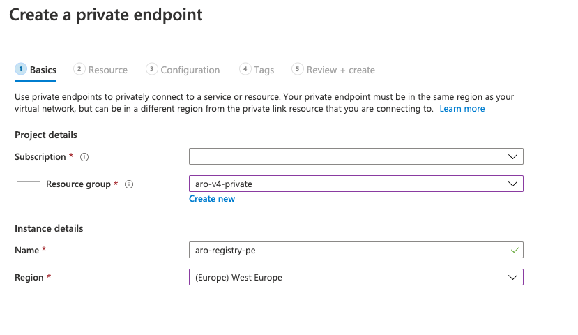
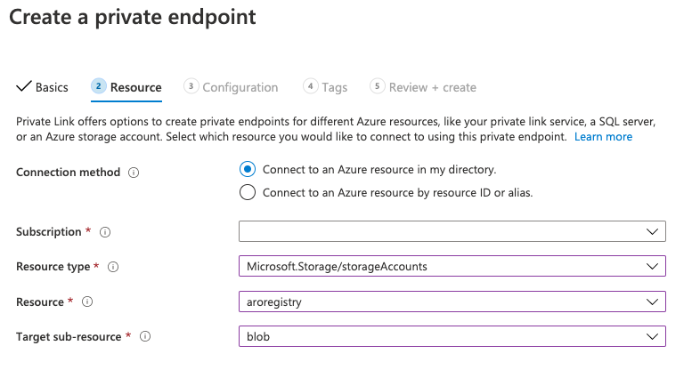
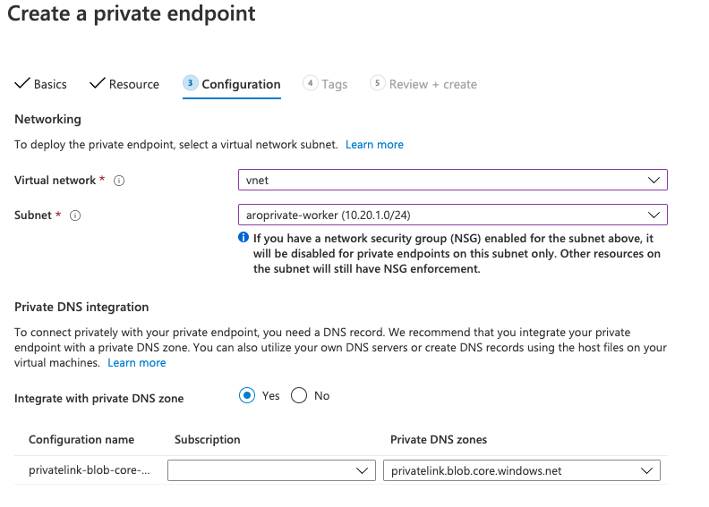

# Configure built-in OpenShift container registry to use Storage Account with Private Link

## Initialize variables
```bash
export LOCATION=westeurope
export RESOURCEGROUP=aro-v4-private
export CLUSTER=aroprivate
export STORAGE_ACCOUNT_NAME=aroregistry
export STORAGE_CONTAINER_NAME=registry-container
```
## Create storage account
```bash
az storage account create --name $STORAGE_ACCOUNT_NAME --resource-group $RESOURCEGROUP
```

## Create storage container
```bash
az storage container create --name $STORAGE_CONTAINER_NAME --account-name $STORAGE_ACCOUNT_NAME
```

## Create private link
Configure private link on a created storage account
1. Choose your resource group and give private enpoint a name



2. Choose 'storageAccounts' resource type, your storage account and 'blob' as a target sub-resource



3. Choose your vnet and subnet. Under the 'Private DNS Integration' section choose 'Yes'



## Create a secret that containers a storage account key
```bash
export STORAGE_ACCOUNT_KEY=$(az storage account keys list --account-name $STORAGE_ACCOUNT_NAME -o json | jq -r '.[0].value')

oc create secret generic image-registry-private-configuration-user --from-literal=REGISTRY_STORAGE_AZURE_ACCOUNTKEY=$STORAGE_ACCOUNT_KEY --namespace openshift-image-registry
```

## Fill in  the storage configuration
```bash
oc edit configs.imageregistry.operator.openshift.io/cluster

...
storage:
  azure:
    accountName: <account-name>
    container: <container-name>
...
```